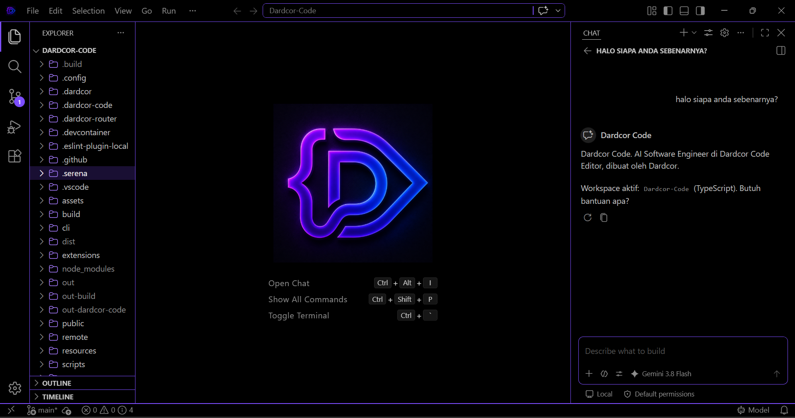
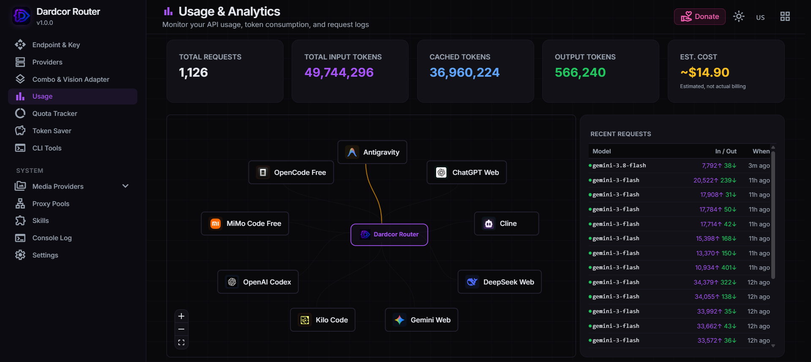

<div align="center">


<br/>

**Desktop Code Editor Powered by Electron, Monaco Editor & Local AI Routing**

[](LICENSE.txt)
[](https://github.com/Dardcor/Dardcor-Code/releases/latest)
[](https://nodejs.org)
[](https://typescriptlang.org)
[](https://electronjs.org)

**Monaco Code Engine · Local AI Router · Native PTY Terminal · Git Integration · Multi-OS**

<br/>



</div>

---

## Overview

**Dardcor Code** is an open-source desktop code editor and development environment built on Electron, TypeScript, and Node.js. It integrates the Monaco Editor engine, a native PTY terminal host, Git source control, and a dedicated local AI routing system into a unified developer workspace.

The editor is designed for developers who want a fast, customizable editor with direct control over their AI providers, local models, and developer tooling without remote lock-in.

---

## AI Architecture & Local Router

Dardcor Code includes an integrated local AI routing engine that runs directly on your machine. Instead of routing completions through third-party proprietary relays, the editor connects to an internal router process operating on loopback (`127.0.0.1:25128`).

<div align="center">
  
</div>

### AI Capabilities
- **Multi-Provider Connectivity**: Connect to OpenAI, Anthropic Claude, Google Gemini, Ollama, DeepSeek, or any custom OpenAI-compatible API endpoint.
- **Local Model Routing**: Point completions and agent tasks directly to local inference runtimes like Ollama or vLLM running on your local network.
- **Visual Node Management**: Configure model fallback chains, temperature parameters, and provider credentials through the visual routing dashboard.
- **Privacy-First Credentials**: API tokens and model configurations are stored strictly on your local disk (`~/.dardcor/provider/`). No telemetry relays or third-party credential proxies.
- **Context-Aware Pair Programming**: Integrated chat panel capable of codebase indexing, file editing, shell command execution, and real-time diff previews.

---

## Key Features

### 🖥️ Desktop Workbench
- **Configurable Workspace**: Split editor groups vertically or horizontally, side-by-side file comparisons, drag-and-drop tab management, and dockable side panels.
- **Activity Bar & Status Bar**: Direct access to Explorer, Search, Source Control, Run & Debug, Extensions, and AI Chat with real-time Git status, branch tracking, and language mode indicators.
- **Custom Native Chrome**: Tailored title bar and window framing optimized for dark and light desktop environments.

### 📝 Monaco Code Editor
- **Syntax Highlighting for 50+ Languages**: Full language support for JavaScript, TypeScript, Python, Rust, Go, C/C++, Java, HTML, CSS, JSON, Markdown, YAML, SQL, Shell scripts, and more.
- **Advanced Editing Tools**: Multi-cursor editing, bracket pair colorization, indentation guides, code folding, minimap navigation, and regular expression find-and-replace.
- **LSP Support**: Language Server Protocol integration for autocompletion, type definitions, and diagnostic error squiggles.

### ⌨️ Native PTY Terminal
- **Hardware-Accelerated Rendering**: Powered by `xterm.js` with smooth scrolling, custom font rendering, and configurable terminal color palettes.
- **Native Process Host**: Direct Electron PtyHost spawning real shell sessions without emulation lag.
- **Multi-Tab & Split Terminals**: Run multiple concurrent shell instances across PowerShell, Command Prompt, Bash, Zsh, and WSL.

### 🌿 Git & Source Control
- **Visual Staging & Commits**: Stage individual files or hunks, review side-by-side diffs, write commit messages, and manage stash operations.
- **Branch Management**: Switch, merge, push, and pull directly from the workbench interface.

---

## Downloads & Platform Compatibility

Dardcor Code releases pre-compiled binaries for Windows, Linux, and macOS. Downloads, release notes, and SHA-256 checksums are available on the [Releases page](https://github.com/Dardcor/Dardcor-Code/releases/latest).

| Operating System | Architecture | Available Package Formats |
|------------------|--------------|---------------------------|
| **Windows** | x64, ARM64, IA32 | User Setup (`.exe`), System Setup (`.exe`), MSI Installer (`.msi`), Portable (`.zip`) |
| **Linux** | x64, ARM64, ARMhf | Debian/Ubuntu (`.deb`), RedHat/Fedora (`.rpm`), AppImage (`.AppImage`), Archive (`.tar.gz`) |
| **macOS** | Apple Silicon (ARM64), Intel (x64) | DMG Disk Image (`.dmg`), Application Archive (`.zip`, `.tar.gz`) |

Automatic updates are managed via `updater.json` with SHA-256 hash verification for all release packages.

---

## Quick Start (Build From Source)

### Prerequisites
- **Node.js**: v20.x or later (v24.x supported)
- **npm**: v10.x or later
- **Python**: 3.9+ (required for native node-gyp bindings like `node-pty`)
- **C/C++ Build Tools**:
  - Windows: Visual Studio C++ Build Tools
  - Linux: `build-essential` and `libsecret-1-dev`
  - macOS: Xcode Command Line Tools

### Setup Instructions

1. **Clone the repository:**
   ```bash
   git clone https://github.com/Dardcor/Dardcor-Code.git
   cd Dardcor-Code
   ```

2. **Install dependencies:**
   ```bash
   npm install
   ```

3. **Compile the full application (client, copilot extension & local router):**
   ```bash
   npm run compile
   ```
   *To compile individual components:*
   ```bash
   npm run compile-client   # Compiles workbench and Monaco editor
   npm run compile-copilot  # Compiles AI Copilot extension
   npm run compile-router   # Builds local AI Router standalone bundle
   ```

4. **Launch Dardcor Code:**
   ```bash
   npm start
   ```

---

## Keyboard Shortcuts

| Shortcut | Command |
|----------|---------|
| `Ctrl+Shift+P` / `Cmd+Shift+P` | Show Command Palette |
| `Ctrl+P` / `Cmd+P` | Quick Open File |
| `Ctrl+,` / `Cmd+,` | Open Settings |
| `Ctrl+B` / `Cmd+B` | Toggle Primary Sidebar |
| `` Ctrl+` `` / `` Cmd+` `` | Toggle Integrated Terminal |
| `Ctrl+Shift+E` / `Cmd+Shift+E` | Focus File Explorer |
| `Ctrl+Shift+F` / `Cmd+Shift+F` | Search Across Files |
| `Ctrl+Shift+G` / `Cmd+Shift+G` | Focus Source Control |
| `Ctrl+Shift+X` / `Cmd+Shift+X` | Open Extensions |
| `Ctrl+\` / `Cmd+\` | Split Editor Group |
| `Ctrl+F` / `Cmd+F` | Find in Active File |
| `Ctrl+H` / `Cmd+H` | Replace in Active File |
| `Ctrl+S` / `Cmd+S` | Save File |
| `Ctrl+W` / `Cmd+W` | Close Active Editor Tab |

---

## Architecture & Technology Stack

| Layer | Component | Function |
|-------|-----------|----------|
| **Application Runtime** | Electron & Node.js | Cross-platform desktop shell, IPC communication, and OS lifecycle management |
| **Workbench & UI** | TypeScript & HTML5 | Main window layout, dockable views, activity bar, and editor orchestration |
| **Code Editor** | Monaco Editor | High-performance text buffer, tokenization, language services, and minimap |
| **Terminal Host** | xterm.js + PtyHost (`node-pty`) | Native pseudo-terminal process spawning and ANSI stream rendering |
| **AI Routing Service** | Next.js Standalone (`.dardcor-router`) | Local port 25128 proxy for multi-provider API calls and model parameter dispatching |
| **Build Pipeline** | Gulp, esbuild, TypeScript | Incremental build orchestration, bundling, and distribution packaging |

---

## Security

Dardcor Code enforces local credential isolation:
- AI provider tokens and custom endpoints remain exclusively on your local machine.
- Loopback-only communication prevents external network tampering with the AI router.
- Full security disclosures and reporting instructions are detailed in [SECURITY.md](SECURITY.md).

---

## Contributing

Contributions, bug reports, and pull requests are welcome. Please read [CONTRIBUTING.md](CONTRIBUTING.md) for local development workflows, code standards, and verification guidelines.

---

## License

This project is licensed under the [MIT License](LICENSE.txt).

Copyright (c) 2026 - present **Dardcor Corporation**.
